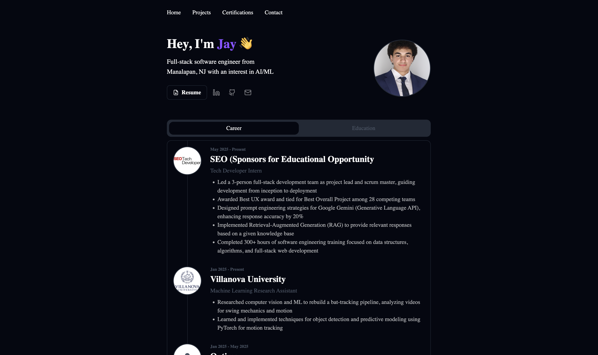

# My Personal Portfolio

A clean, minimal portfolio website built with React & Tailwind CSS

## Live Demo

Check it out here: **[https://jaylen-bradley-portfolio.vercel.app](https://jaylen-bradley-portfolio.vercel.app)**



## Tech Stack

- React
- Tailwind CSS
- Vercel (hosting)
- Formspree (email)

## Getting Started

```bash
git clone https://github.com/JaylenBradley/Portfolio.git
cd Portfolio
npm install
npm run dev
```

## Customization

- Update personal info in `src/data/*.json`
- Replace projects in `src/data/projects.json`
- Add your resume to `src/pages/Home.jsx`

## Deployment

Deploy to Vercel:

1. Push to GitHub
2. Connect repo to Vercel
3. Deploy
